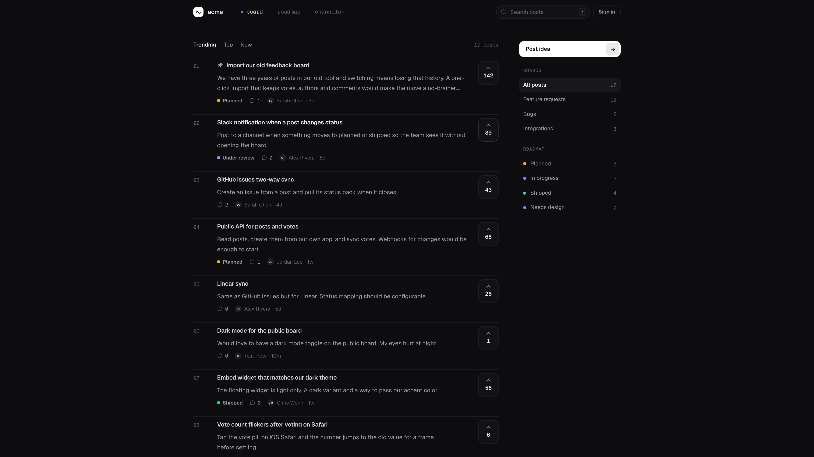

<p align="center">
  <a href="https://openheard.com"></a>
</p>

<h1 align="center">openheard</h1>

<p align="center">
  Open source feedback board, roadmap and changelog.<br />
  The Canny alternative that runs on Cloudflare's free tier.
</p>

<p align="center">
  <a href="https://openheard.com">Website</a> ·
  <a href="https://openheard.com/changelog">Changelog</a> ·
  <a href="docs/api.md">API</a> ·
  <a href="docs/mcp.md">MCP</a> ·
  <a href="DESIGN.md">Design</a> ·
  <a href="CONTRIBUTING.md">Contributing</a>
</p>

<p align="center">
  <a href="LICENSE"></a>
  <a href="https://github.com/Heilonng23/openheard/stargazers"></a>
  <a href="https://github.com/Heilonng23/openheard/actions/workflows/ci.yml"></a>
</p>

<p align="center">
  
</p>

## Why

Collecting feedback should not cost $79 a month or a weekend of Docker.
Every open source feedback tool needs a VPS, Postgres and someone to babysit
it, and most of them look like an admin template.

openheard is one Cloudflare Worker and one D1 database. It deploys in two
commands, runs on the free tier, and is designed like a product people would
pay for. Self-hosting is the default, not the afterthought.

## Features

**Collect**
- Public board with voting, search, sorting and keyboard navigation
- Posts with comments, reactions and a status timeline
- Images on posts and comments: paste, drop or pick, stored in R2
- Anonymous voting, sign-in gate on posting, optional approval queue
- Sign in with Google, magic link or password

**Manage**
- Dashboard with inbox, internal notes, merge, pin, tags and ETA
- Custom statuses that drive the roadmap columns
- Team invites, admin and member roles, join links
- Import from a CSV export of Canny or similar tools; export to JSON and CSV

**Publish**
- Roadmap with drag between columns
- Changelog with an editor, linked shipped posts and an RSS feed
- Branding: accent colour pulled from your website, board name

**Extend**
- HTTP API with per-workspace keys at `/api/v1` ([docs](docs/api.md))
- MCP server at `/api/mcp` so Claude, Cursor and other agents can read and
  triage feedback ([docs](docs/mcp.md))
- Embeddable widget: one script tag puts feedback, the roadmap and the
  changelog inside your own app, with a "new" badge for fresh releases
  ([docs](docs/widget.md))
- Multi-workspace: each workspace lives on its own subdomain

Coming next: changelog email subscribers, a CLI and a docs site.

## Get started

### Cloud

Sign up at [openheard.com](https://openheard.com). Your board lives at
`<slug>.openheard.com`. There is a free tier.

### Self-host on Cloudflare

Needs a Cloudflare account. Everything fits in the free tier.

```bash
git clone https://github.com/Heilonng23/openheard && cd openheard
bun install
cp packages/infra/.env.example packages/infra/.env   # set BETTER_AUTH_SECRET
cd packages/infra && bunx alchemy login --configure && cd ../..
bun run deploy
```

That provisions the Worker, the D1 database, KV and an R2 bucket for images,
applies migrations and prints your URL. R2 has to be switched on once in the
Cloudflare dashboard before the first deploy; its free tier covers 10 GB. The first account to sign up becomes the admin.

#### Behind Cloudflare Access

To keep a board internal, put a [Cloudflare Access](https://developers.cloudflare.com/cloudflare-one/applications/)
application in front of it. Set these in `packages/infra/.env` and redeploy,
and people signed in to Access (or to WARP) land in openheard already signed
in, with no second login:

```bash
CF_ACCESS_TEAM_DOMAIN=yourteam.cloudflareaccess.com   # Zero Trust > Settings
CF_ACCESS_AUD=<the application's Audience (AUD) tag>  # Access application overview
```

The Access identity's email is matched to an existing account or creates one,
exactly like a magic link. Signing out of openheard only lasts until the next
page load while Access is in front; sign out of Access to leave.

### Run locally

No Cloudflare account needed. A SQLite file stands in for D1.

```bash
bun install
bun run db:push:local   # creates apps/web/local.db
bun run dev:local       # http://localhost:3001
bun run db:seed         # optional demo posts
```

Keyboard on the board: `j` `k` move, `v` vote, `enter` open, `/` search,
`c` new post.

## Stack

- [TanStack Start](https://tanstack.com/start), React 19, TypeScript
- Cloudflare Workers, D1, KV and R2, provisioned with [Alchemy](https://alchemy.run)
- [Drizzle ORM](https://orm.drizzle.team), [Better Auth](https://better-auth.com)
- Tailwind 4, Base UI primitives, Phosphor icons, Geist

Design rules live in [DESIGN.md](DESIGN.md). Read it before touching UI.

## Contributing

Bug reports and pull requests are welcome. See [CONTRIBUTING.md](CONTRIBUTING.md)
for local setup and the checks a PR needs to pass. Security issues go to the
contact in [SECURITY.md](SECURITY.md), not the issue tracker.

Built in the open for [The Build Games](https://canivibecodeit.com/thebuildgames),
September 2026.

## License

The app (`apps/web`, `packages/db`, `packages/auth`, `packages/ui`) is
[AGPL-3.0](LICENSE). Self-host it freely; if you run a modified version as a
service, publish your changes.

The pieces you embed in your own product, the widget, the CLI and the API
client, will ship under MIT in their own packages so they never touch your
licence.
